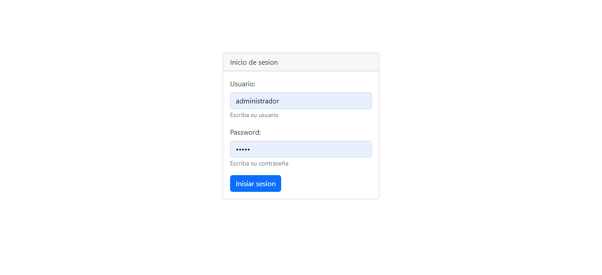
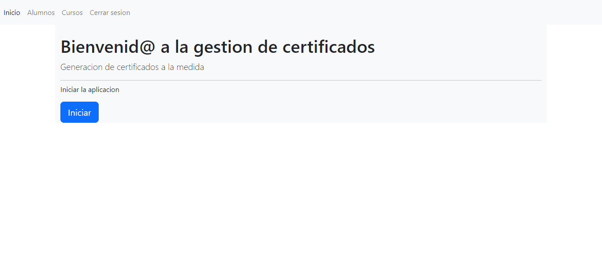
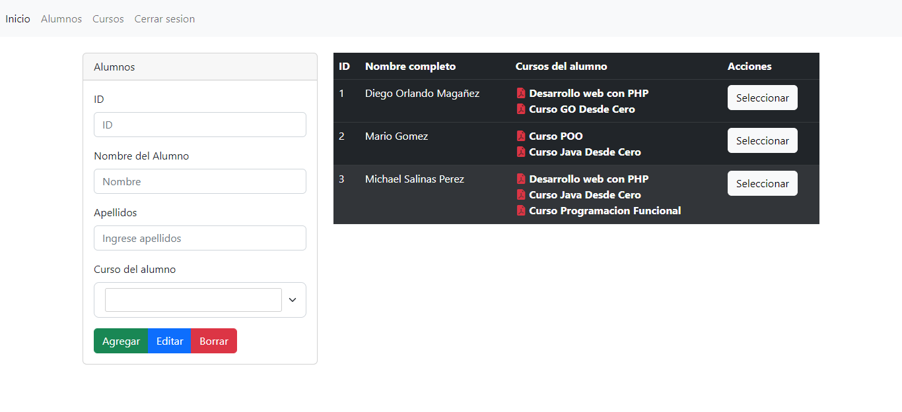
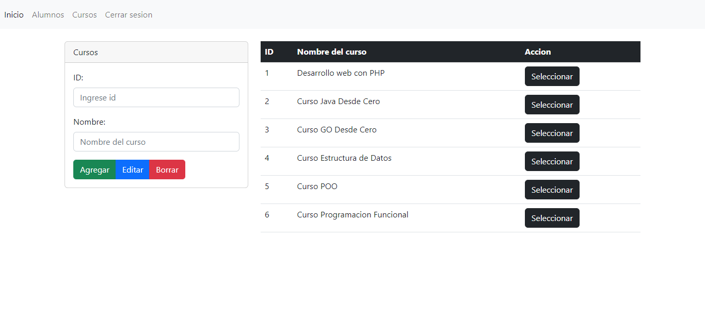
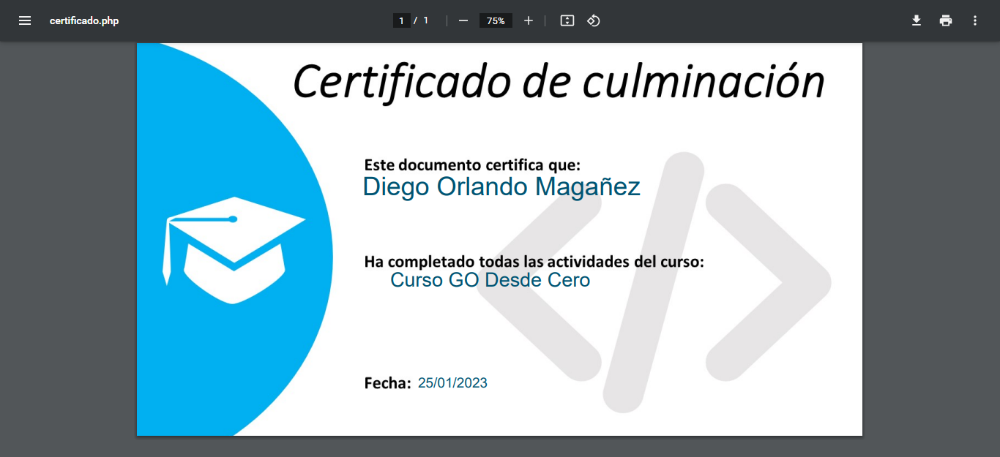

# App Web Cursos & Certificaciones

##  Login de Sesión

    

##  Inicio

    

##  Tabla Alumnos

    

##  Tabla Cursos

    

##  Certificado del alumno **Diego Orlando Magañez** en el curso **Desarrollo web con PHP**

    

##  Certificado del alumno **Diego Orlando Magañez** en el curso **Curso GO Desde Cero**

    

## Base de Datos
La DB se encontrara en la carpeta **DB**.

## Relacion Tablas
La relacion en la **llave foranea** (on delete: **CASCADE** & on update: **CASCADE**). 
Para cada vez que se elimine un registro y cada actualizacion en las tablas **cursos** y **alumnos** se aplicaran a la tabla **alumnos_cursos** que tiene relacion con ambas tablas mencionadas.

    

## Libreria: [FPDF](http://www.fpdf.org/)
Permitira generar documentos en formato PDF.